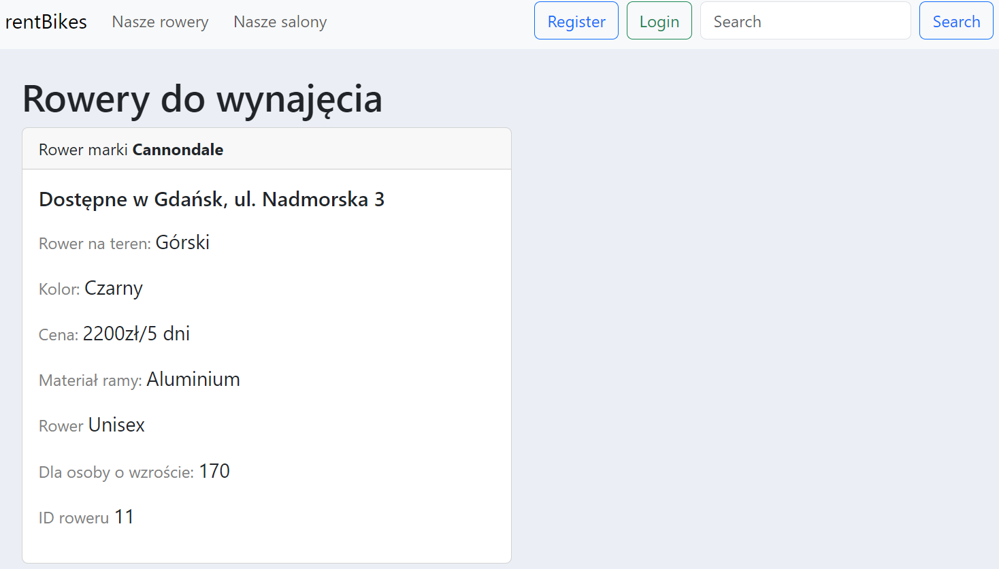
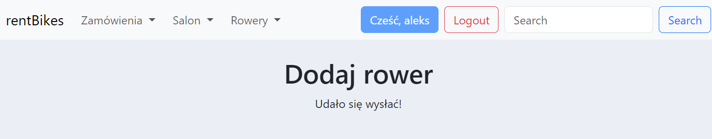

# Raport z projektu aplikacji webowej do zarządzania wypożyczalnią rowerów

1. Realizacja, użyte narzędzia
   Bazę danych stworzono przy pomocy SQL Server 2022, następnie jednak zmieniając wersję na SQL Server 2019. Aplikacja
   została stworzona w frameworku Django. Aby połączyć bazę danych z aplikacją, stworzono osobne środowisko
   programistyczne przy pomocy condy. Najistotniejszymi pakietami w tym przypadku są pyodbc oraz django. Należało mieć
   również odpowiedni sterownik ODBC.
2. Baza danych
   Baza danych została stworzona przy pomocy SQL Server Management Studio. Została utworzona za pomocą kwerend:
   ```sql
   create table Klient (
      ID_klienta int identity(1,1) not null,
      Imie varchar(40) not null,
      Nazwisko varchar(40) not null,
      Miasto varchar(80) not null,
      Mail varchar(40), 
      Telefon int unique,
      Wzrost int,
      Waga int,
      constraint pk_ID_klienta primary key(ID_klienta));
   
   create table Salon(
      ID_salonu int identity(1,1) not null,
      Miasto varchar(40) not null,
      Ulica varchar(80) not null,
      constraint pk_ID_salonu primary key(ID_salonu));
   
   create table Pracownicy (
       ID_pracownika int identity(1,1) not null,
       Imie varchar(40) not null,
       Nazwisko varchar(40) not null, 
       Data_zatrudnienia datetime not null,
       ID_salonu int not null,
       constraint pk_ID_pracownika primary key(ID_pracownika),
       foreign key (ID_salonu) references Salon (ID_salonu));
   
   create table Oplata(
      ID_oplaty int identity(1,1) not null,
      Kwota int not null,
      Waluta varchar(40) not null,
      Rodzaj_paragonu varchar(40) not null,
      constraint pk_ID_oplaty primary key(ID_oplaty));
   
   create table Rower (
       ID_roweru int identity(1,1) not null,
       ID_salonu int not null,
       Marka varchar(40) not null,
       Koszt int not null,
       Wysokosc varchar(40) not null,
       Kolor varchar(40) not null,
       Przeznaczenie_plciowe varchar(6) not null,
       Material_ramy varchar(40),
       Rodzaj_roweru varchar(40) not null,
       constraint pk_ID_roweru primary key(ID_roweru),
       foreign key (ID_salonu) references Salon (ID_salonu));
   
   create table Wypozyczenia (
      ID_wypozyczenia int identity(1,1) not null,
      Data_wypozyczenia datetime not null,
      Data_zwrotu datetime not null, 
       ID_pracownika int not null,
       ID_roweru int not null,
       ID_klienta int not null,
       ID_oplaty int not null,
       constraint pk_ID_wypozyczenia primary key(ID_wypozyczenia),
       foreign key (ID_roweru) references Rower (ID_roweru),
       foreign key (ID_klienta) references Klient (ID_klienta),
       foreign key (ID_oplaty) references Oplata (ID_oplaty),
       foreign key (ID_pracownika) references Pracownicy (ID_pracownika));
   ```
   Następnie utworzono nastepujące wyzwalacze
    ```sql
    CREATE TRIGGER usun_wypozyczenia_po_usuwaniu_pracownika
   ON Pracownicy
   INSTEAD OF DELETE 
   AS 
   BEGIN
       SET NOCOUNT ON
     DELETE FROM Wypozyczenia WHERE ID_pracownika IN (SELECT ID_pracownika FROM DELETED);
     DELETE FROM Pracownicy WHERE ID_pracownika IN (SELECT ID_pracownika FROM DELETED);
   
   END; 
   CREATE TRIGGER Usuwanie_wypozyczenia_po_usuwaniu_klienta
   ON Klient INSTEAD OF DELETE 
   AS 
   BEGIN
       SET NOCOUNT ON
       DELETE FROM Wypozyczenia WHERE ID_klienta IN (SELECT ID_klienta FROM DELETED);
       DELETE FROM Klient WHERE ID_klienta IN (SELECT ID_klienta FROM DELETED);
   END;
   
   CREATE TRIGGER usun_wypozyczenia_po_usunieciu_roweru
   ON Rower INSTEAD OF DELETE 
   AS 
   BEGIN
       SET NOCOUNT ON
       DELETE FROM Wypozyczenia WHERE ID_roweru IN (SELECT ID_roweru FROM DELETED);
       DELETE FROM Rower WHERE ID_roweru IN (SELECT ID_roweru FROM DELETED);
   END;
   
   CREATE TRIGGER usun_pracownikow_i_rowery_po_usunieciu_salonu
   ON Salon
   INSTEAD OF DELETE 
   AS 
   BEGIN
       SET NOCOUNT ON
       DELETE FROM Rower WHERE ID_salonu IN (SELECT ID_salonu FROM DELETED);
       DELETE FROM Pracownicy WHERE ID_salonu IN (SELECT ID_salonu FROM DELETED);
       DELETE FROM Salon WHERE ID_salonu IN (SELECT ID_salonu FROM DELETED);
   
   END;
   ```
   Aby połączyć się z bazą danych w aplikacji, należy w pliku settings.py dodać następujące linie kodu:
   ```python
    DATABASES = {
         'default': {
              'ENGINE': 'sql_server.pyodbc',
              'OPTIONS': {
                'driver': 'ODBC Driver 17 for SQL Server',
              },
         },
    }
    ```
3. Diagramy czynności:

   
4. Diagram klas:

   

   Dolna część diagramu przedstawia klasy, które są związane z bazą danych, stworzonej przeze mnie. Górna część
   przedstawia klasy, które zostały wygenerowane przez django przy pomocy komendy.

   `python manage.py inspectdb`.

   
5. Użytkowanie aplikacji.

   Aplikacja ma kilka różnych funkcji. Niestety odbiega dalece od tego, czym miała na początku być. Przedstawię jednak,
   jakie funkcje ostatecznie pojawiły się w aplikacji webowej.
    1. Strona główna

       

       Na stronie głównej znajduje się menu, które pozwala na przejście do innych stron. Znajduje się tam również
       przycisk, który pozwala na wylogowanie się z aplikacji. Również gdy użytkownik nie jest zalogowany menu zmienia
       się, a pojawia się przycisk do rejestracji oraz do logowania. Ponadto można szukać rowerów w polu szukania.

       

       U góry pojawia się również powiadomienie które, czy udało się zalogować bądź wylogować, a także zarejestrować.
       Przycisk z napisem rentBikes przenosi do strony domowej. Przycisk Nasze rowery przenosi do strony, na której
       wyświetlana jest lista rowerów. Przycisk Nasze Salony przenosi na witrynę, na której wyświetlana jest lista
       salonów.

       Podczas gdy użytkownik jest zalogowany mamy do dyspozycji również przycisk z zamówieniami, można tam dodać
       zamówienie, lub zobaczyć wszystkie istniejące zamówienia. Pojawia się również menu Salon, które zawiera
       odniesienia do witryn służących do dodawania, edytowania, aktualizowania salonu. Jest też menu Rowery, które
       zawiera odniesienia do stron, na których możliwe jest dodanie roweru oraz usunięcie roweru.

       

       Działanie wyszukiwarki rowerów:

       
       Po wpisaniu w wyszukiwarkę słowa "trek" wyświetlają się wszystkie rowery, które mają w nazwie słowo "trek". Szuka
       również po typie roweru, czyli czy miejski, górski, trekkingowy itd. Również dla kogo przeznaczony czy damski czy
       męski czy unisex.

    2. Opcje dla użytkownika niezalogowanego
        1. Nasze rowery.

           Na tej witrynie można zobaczyć jakie rowery są dostępne w wypożyczalni.

           

        2. Nasze salony.

           Na tej witrynie można zobaczyć w jakich salonach można wypożyczyć rower.

           

           Można również przejść do konkretnej podstrony salonu, na której wyświetlone są informacje o salonie.

           

        3. Rejestracja

           Jest to strona, na której można się zarejestrować. Po poprawnym wypełnieniu formularza, użytkownik zostaje
           zarejestrowany w bazie danych. Pojawi się również powiadomienie o poprawnej rejestracji.

           

           Zwracana jest uwaga na to, aby oba hasła były identyczne oraz aby email był poprawny.

           

        4. Logowanie

           Jest to strona, na której można się zalogować. Po poprawnym wypełnieniu formularza, użytkownik zostaje
           zalogowany. Pojawi się również powiadomienie o poprawnym zalogowaniu.

           

           Zwracana jest uwaga na to, aby podane dane były poprawne.

           

    3. Opcje dla użytkownika zalogowanego
        1. Dodawanie zamówienia

           Jest to strona, na której można dodać zamówienie. Po poprawnym wypełnieniu formularza, zamówienie zostaje
           dodane do bazy danych. Pojawi się również powiadomienie o poprawnym dodaniu zamówienia.

           

           Wypełniony formularz: Zwraca się uwage jedynie na to czy dany rower nie został już wypożyczony oraz
           sprawdzane są formaty dat.

           

        2. Wypożyczenia
       
           Jest to strona na której można zobaczyć wszystkie wypożyczenia. Można również przejść do podstrony
           wypozyczenia i przeglądać jego szczegóły. Można również usunąć wypożyczenie.

           

           Szczegóły wypożyczenia:
           
           
         
        3. Salon
       
           Dodawanie salonu - strona na której można dodać salon. Po poprawnym wypełnieniu formularza, salon zostaje
           utworzony. Pojawi się również powiadomienie o poprawnym dodaniu salonu.

           

           Komunikat o poprawnym dodaniu salonu.

           

           Nasze salony - strona na której można edytować oraz usunąć salon. Po poprawnym wypełnieniu formularza, salon
           zostaje zaktualizowany o najnowsze dane.
           
           

        4. Rowery
       
           Dodawanie roweru - strona na której można dodać rower. Po poprawnym wypełnieniu formularza, rower zostaje
           utworzony. Pojawi się również powiadomienie o poprawnym dodaniu roweru.

           

           Wypełniony formularz

           

           Komunikat o poprawnym dodaniu roweru.

           

           Nasze rowery - strona na której można usunąć rower.

           
           
    4. Opcje dostępne dla admina:
        1. Ekran logowania

           

        2. Możliwości dodawania wielu recordów do tabel w bazie danych.

           Możliwe jest też dodawanie autoryzowanych użytkowników oraz autoryzowane grupy. Jest to ekran administracji strony.

           
           
        3. Możliwość edytowania permisji poszczególnych grup użytkowników.
         
           

           Edycja permisji:

           

        4. Dodawanie i usuwanie recordów z bazy danych. 

           Oprócz tego możliwe jest też filtrowanie. Zostało to
           przeprowadzone na tabeli z rowerami.

           

           Jeden konkretny wyfiltrowany rower:

           
           
6. Podsumowanie

   Bardzo zainteresował mnie temat aplikacji webowych, a w szczególności przy wykorzystaniu Django. Zdecydowanie
   najtrudniejszym etapem, który należało przezwyciężyć było nawiązanie połączenia między SQL Serverem, a aplikacją
   Django.

   Mam wciąż wiele pomysłów na poprawki i ulepszenie aplikacji, jednak teraz już nie starczyło czasu na ich realizację.
   Nie zdążyłem dzisiaj zaprezentować aplikacji, ponieważ po zajęciach miałem następne zajęcia. Mógłbym zaprezentować
   aplikację w innym terminie, wyznaczonym za pośrednictwem komunikacji mailowej. Również nie otrzymałem żadnej
   informacji zwrotnej od Doktora Kozłowskiego na temat etapu drugiego.